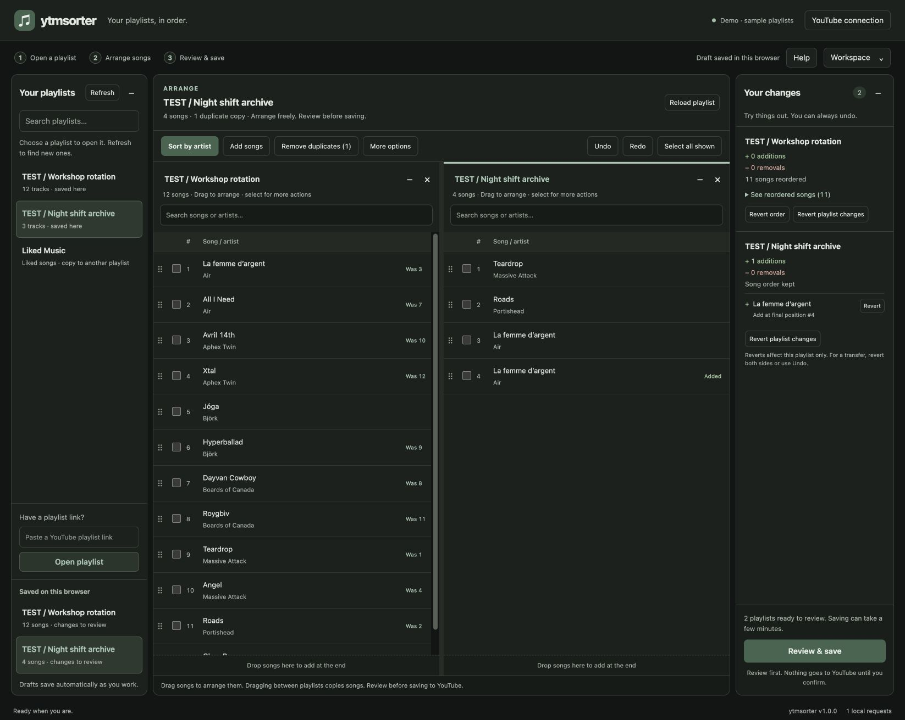

# ytmsorter

A friendly, local-first editor for your YouTube playlists. Find a playlist, arrange your songs, and
review your changes before saving to YouTube. Sort by artist, remove duplicate videos, add songs, or
copy and move them between playlists. Your drafts save automatically in your browser, with Undo if
you change your mind. The interface always uses a dark theme, including forms and dialogs.

Open several playlists side by side and drag tracks within or between them. Your open playlists
return when you do. Choose compact or comfortable song spacing. Advanced options, backups, and the
activity log stay out of the way until you need them.

Your browser owns the workspace. Docker is a disposable worker. No Google Cloud project, OAuth
setup, database, data volume, analytics, or remote UI assets.



_Synthetic demo playlists. The active playlist has one duplicate copy; all changes are local
drafts._

> This uses YouTube's unofficial internal API through
> [YouTube.js](https://github.com/LuanRT/YouTube.js). It can break, and no tool can promise that
> cookie-based automation will never trigger account restrictions. Use your own editable playlists,
> small commits, and keep it on localhost.

## Quick start

Requires Docker with Compose.

```bash
docker compose up --build -d
```

Open [localhost:3000](http://localhost:3000). Use the same browser profile and address each time:
`localhost` and `127.0.0.1` have separate browser storage.

```bash
docker compose logs --tail=50
docker compose down
```

Stopping/rebuilding Docker does not erase browser drafts. There is no data volume in this version.
Do not restart during a commit unless necessary.

### Connect your YouTube session

1. Sign in to YouTube in your normal browser and select the intended channel.
2. Open Developer Tools → **Network**, reload YouTube, then select a request to `www.youtube.com`
   (for example `/youtubei/v1/browse`).
3. Expand **Request Headers** and copy the **Cookie** header value. If it is not visible, choose
   another authenticated YouTube request—not a Google Accounts request or a static image. It is not
   under Response Headers.
4. Choose **Connect YouTube**, paste it into the dialog, and click **Connect YouTube**. The dialog
   includes the same step-by-step instructions.

The Application → Cookies table lists individual values, but the request header is the simplest way
to copy the set actually sent by your browser. Do not use `document.cookie`: it excludes HttpOnly
values. A Netscape `cookies.txt` export also works; paste its contents. Only unexpired
YouTube-domain entries are used. No browser extension is required by the request-header method.

For multiple accounts, the advanced **Account index** corresponds to the YouTube request's
`X-Goog-AuthUser` value. A delegated/Brand Account can require the `X-Goog-PageId` value in
**Delegated channel ID**. Leave these at their defaults unless your selected account needs them.

Cookies are powerful credentials. Paste them only into your local app, never chat, issues, or a
public website. **Remember my connection in this browser** stores them in IndexedDB; unchecked uses
tab-session storage. Neither is encrypted by this app. **Disconnect** forgets the app's credentials,
not your Google session.

The header shows the selected YouTube channel name returned during connection. **YouTube connection
→ Check saved connection** refreshes it without pasting cookies again. On reload, **Saved
connection** shows the cached name, not a new authentication check. A green indicator identifies a
connected or saved session; it is not a polling indicator. If YouTube omits the selected name, the
UI says so rather than guessing another channel. Names stay with browser credentials, outside
exports.

## Using the editor

The app always uses dark mode, regardless of your browser or system theme. New workspaces use
comfortable song spacing; **Workspace → Song spacing** lets you choose compact rows. The
getting-started screen guides you to your playlists, while backups, save history, panel visibility,
and layout reset live in the **Workspace** menu.

The playlist with a green line at the top is the one you are editing. Select songs with their
checkboxes to reveal move, remove, copy, and transfer controls. **Copy songs** leaves the source
playlist alone; **Move songs** removes those entries from the source after adding them to the
destination. Open both playlists and choose a destination before using either button.

### Everyday workflow

1. Choose **Find my playlists** or **Refresh**, or paste a playlist URL and **Open playlist**. Open
   both source and destination before copying/transferring.
2. **Sort by artist** groups songs. Drag songs to arrange them, or select their checkboxes to reveal
   **Move up**, **Move down**, **Remove**, **Copy songs**, and **Move songs**. Search each playlist
   by song or artist. **Add songs** opens a field for video links; **Remove duplicates** cleans up
   repeated videos. **More options** contains sort settings and exact positions.
3. Inspect **Your changes**. Each added track has its own **Revert**; each removal has **Restore**.
   **Revert order** preserves membership edits. A playlist-level revert leaves other playlists
   alone.
4. **Undo / Redo** reverses whole workspace edits, including both sides of a transfer. `Ctrl/⌘ Z`
   and `Ctrl/⌘ Shift Z` work outside form fields.
5. **Review & save** shows all removals and final track orders. Check the confirmation box and
   choose **Save changes to YouTube**. Watch the timestamped check/write/confirmed/verify events.
6. After a successful commit, reload to start fresh. If a commit fails, keep the draft and use
   **Reconnect & keep edits**; don't discard hours of editing.

### Remove duplicate songs

**Remove duplicates** keeps the first occurrence of each YouTube video in the active playlist’s
current order and removes extra copies. Its count shows how many extra entries will be removed. It
works across the whole playlist, including songs hidden by search, and includes any songs you have
just added or copied. Different uploads or versions of a song remain separate. Undo restores the
removed copies; review and confirm before anything changes on YouTube. The action is disabled when
there are no duplicates, the playlist is read-only, or the draft needs recovery. Existing duplicate
entries stay distinct until you choose to remove them; copying and adding songs do not silently
deduplicate.

### Review your edits

Your changes panel shows the net difference from the loaded snapshot, not one entry per mouse
gesture. Additions show their **final position**; the expandable **See reordered songs** section
lists existing tracks whose relative order changed, with loaded → final positions. Shifts caused
only by inserting/removing other tracks are not mislabeled as reorders. **Revert order** keeps
membership edits staged; workspace Undo reverses the last edit. Review still shows the complete
final order.

### Split panes and drag/drop

Your open playlists and active editor return on page reload; saved drafts and changes remain in the
sidebar. A new or empty workspace shows a getting-started screen with **Connect YouTube** / **Find
my playlists** and, when available, **Open saved playlists**. Closing a view keeps its draft.
Loading a playlist opens another editor pane; clicking an already loaded playlist focuses or reopens
its pane without fetching again. Each pane has its own filter, selection and scroll position. The
green line marks the active playlist: the shared **Sort by artist**, **Add songs**, and **More
options** controls apply to it. Selecting songs reveals the copy/move bar, which requires an
editable destination before enabling its buttons. More options contains artist settings, exact
positions, and drag behaviour.

- Drag a song (including its linked title), or the `⠿` grip, to reorder it. Select several tracks
  first to drag them together in their existing order. The insertion line shows the exact position;
  dropping into empty space appends to the end, even in a filtered view.
- Cross-playlist drags **copy** by default. Choose **More options → Dragging to another playlist →
  Moves songs** to move instead. Hold **Alt, Ctrl or ⌘** to copy, or choose **Dragging to another
  playlist → Copies songs**. Read-only sources always copy; stale or read-only destinations reject
  drops. External browser/file drags are ignored.
- Drags only stage changes. Undo reverses both sides of a move; Your changes panel still allows
  individual additions/removals to be reverted. Duplicate videos remain separate entries. There are
  no per-track Remove buttons: use the selection **Remove** action instead.
- Drag dividers between playlists, the library, Your changes panel, or the activity log. Focus a
  divider and use arrow keys for keyboard resizing; double-click to reset its size. **Reset layout**
  restores default panels and opens loaded drafts.
- **−** minimizes a playlist to a vertical tab; click it to restore. **×** closes only the view,
  never the draft. **Workspace → Playlists / Changes / Activity** buttons restore hidden panels.
  Activity is hidden in a new workspace and opens while saving to YouTube; the latest status stays
  visible in the footer. Pane sizes, utility-panel visibility and drag mode persist through reloads
  and workspace exports. Selections, filters and scroll positions are kept while the page is open,
  not across reloads.

On narrow screens, utility panels stack and playlist editors scroll horizontally. Dragging uses
pointer events rather than the browser's native HTML drag behavior. On touch devices drag the grip;
swipe elsewhere to scroll. Drop on a row to insert at its line, or on a playlist header/footer to
append. Escape cancels a drag.

Filtering, sorting, selecting, staging, individual reverts, undo/redo, exporting, and review make
**no YouTube calls**. Opening the page checks only the local worker. Cookie validation, Refresh,
Open playlist and Reload playlist explicitly contact YouTube; large playlists may need several
continuation requests. Commit tracking polls only the worker's in-memory receipt. Nothing
auto-commits or runs on a schedule.

Track names link directly to videos. Newly pasted URLs display video IDs until a post-commit reload
retrieves metadata. Copies keep known display metadata. Duplicate videos are distinct playlist
entries and can be edited independently. Removing an entry does not delete the video itself.

**Liked Music (`LM`)** is always shown as a system shortcut because it can be omitted by the regular
library listing. It loads on demand as a read-only copy source. Copy its songs into an editable
playlist to sort them; this application does not turn removals into unlike actions. Playlist
creation/deletion is not implemented.

Artist inference uses channel names (cleaning Topic/VEVO suffixes), title prefixes such as
`Artist - Song`, or video-ID overrides. It is a heuristic, not an official music-credit database.
Check compilations and user uploads in the preview.

## Persistence and backups

| Data                                                                       | Where it lives         | Survives Docker restart?           |
| -------------------------------------------------------------------------- | ---------------------- | ---------------------------------- |
| Loaded library, original snapshots, staged drafts, artist options, density | Browser IndexedDB      | Yes                                |
| Up to 30 undo/redo steps, 200 activity events, 20 commit receipts          | Browser IndexedDB      | Yes                                |
| Pending commit intent and last observed progress                           | Browser IndexedDB      | Yes; never automatically replayed  |
| Remembered cookies                                                         | Browser IndexedDB      | Yes                                |
| Tab-only cookies                                                           | Browser sessionStorage | Yes while that tab session remains |
| Active jobs and submission deduplication                                   | Worker memory          | No                                 |

The save indicator confirms completed browser transactions. Failed saves are visible, with **Retry
save**; a commit cannot be submitted without saving its intent first. Only one tab can edit the same
origin at a time. A second tab is read-only; close the editing tab and reload the other to take
over. This does not coordinate separate browsers, origins, or devices—avoid concurrent upstream
edits.

**Workspace → Export workspace** produces a versioned JSON backup of library metadata, snapshots,
drafts and display/artist preferences. It deliberately excludes cookies, workspace tokens, undo
history, receipts and pending execution intents. **Workspace → Import workspace** validates and
replaces local drafts after confirmation; it does not contact YouTube. Commits still recheck live
state. Keep backups private: they contain playlist names and video IDs.

Browser storage is not an archival backup. Clearing site data, private browsing, profile removal, or
browser storage eviction can erase it. Export important work. Undo/redo survives page reloads, but
resets when loading a fresh snapshot or finishing a commit. Current row selection/filter text is
transient.

### Upgrading from the disk-backed version

Old `ytm-workspace-v1` localStorage drafts migrate to IndexedDB on the same origin. The legacy keys
are removed only after a successful save. Reconnect cookies once: the worker no longer reads the old
Docker volume. Existing volumes and the unused `client_secret.json` are not deleted automatically.
Old unfinished commits become uncertain and require a reload of affected playlists. Export before
upgrading.

## Commit safety and recovery

The worker checks every playlist's live edit access, owner, unique entry IDs, video IDs and exact
order against the browser snapshot before its first write. Any mismatch stops preflight. Additions
are performed and verified before source removals; retained entries are then reordered with a
minimum-length move plan, and the final order is verified. Requests are sequential with at least one
second between writes. Rejected/failed writes are not automatically retried.

YouTube has no atomic transaction for this workflow: a commit can partly succeed. Receipts
distinguish submitted operations from confirmed responses; the last unconfirmed write may also have
succeeded. There is no automatic rollback.

### Expired cookies do not erase your edits

If authentication fails **before any write was submitted**, the draft and undo history remain
usable. Replace cookies in **YouTube connection**, then review and commit again explicitly. An old
job ID only returns its receipt; it never replays writes.

For already-blocked drafts (including ones saved by older versions), choose **Reconnect & keep
edits**. Connecting new cookies also checks blocked drafts. Recovery reads fresh snapshots and keeps
your desired order, additions and removals. It can reconcile partial reorders, completed removals,
and uniquely identifiable additions without adding them twice. No YouTube writes occur until you
review and commit again. A browser-only checkpoint is saved before recovery.

Recovery is all-or-nothing across affected playlists. Wrong ownership, missing desired songs,
unknown live additions or ambiguous duplicates stop recovery; your drafts remain intact and the
conflict is shown above the editor. Export the workspace before manual conflict resolution. Never
use **Reload playlist** to fix an expired session: that explicitly replaces your staged order.

- **Page reload:** resumes tracking the same worker job; does not resubmit it.
- **Connection loss:** keeps drafts locked. Use **Resume tracking** to query the local receipt, not
  repeat edits.
- **Worker restart:** a new boot ID rejects old submissions. The browser keeps its last receipt and
  marks the outcome uncertain. Use **Reconnect & keep edits** to check live state. An observed
  receipt is only a lower bound on completed writes.
- **Unknown job:** use **Unlock for recovery**, then **Reconnect & keep edits**; never assume no
  edits occurred.

Same-ID submissions are deduplicated within one worker lifetime. This is not an exactly-once
guarantee across crashes. The worker retains up to `MAX_JOBS` receipts and then asks for a restart
instead of evicting deduplication records. Run a single worker, not replicas behind a load balancer.

## Configuration

| Variable         | Default                         | Purpose                                                    |
| ---------------- | ------------------------------- | ---------------------------------------------------------- |
| `PORT`           | `3000`                          | Worker HTTP port                                           |
| `HOST`           | `127.0.0.1` (Docker: `0.0.0.0`) | Listen address; Compose publishes loopback only            |
| `BASE_URL`       | `http://localhost:3000`         | Allowed app origin; no path, query or credentials          |
| `MAX_UPDATES`    | `180`                           | Conservative write budget per commit; `0` disables the cap |
| `WRITE_DELAY_MS` | `1000`                          | Minimum delay between writes; cannot be lower than 1000    |
| `MAX_JOBS`       | `500`                           | In-memory receipts retained per worker lifetime            |

Edit Compose environment values, then `docker compose up --build -d`. When changing ports, update
the published port and `BASE_URL` consistently. Changing the browser origin starts a separate
workspace; export/import first. Modern Chromium, Firefox, or Safari with IndexedDB and Web Locks on
a secure context (localhost qualifies) is required. This is a desktop-oriented UI with a stacked
narrow-screen layout.

At most 20 playlists and 10,000 target entries per playlist are accepted in one commit; JSON
requests are capped at 8 MB. Addition budgets are conservative because YouTube chooses insertion
positions. Reorder-only budgets are exact. These are local limits, not official Google API quotas.

The runtime is non-root and read-only, with dropped capabilities, a small temporary filesystem, a
health check and a 45-second graceful shutdown window. No secrets or persistent data mounts are
needed. Keep localhost binding: this is not a public or multi-user service. See
[SECURITY.md](SECURITY.md).

## Development and tests

```bash
npm ci
npm run check
npm run format:check
npm start
```

Node.js 24 is required. Docker builds run the syntax checks and automated tests. Run the formatting
check locally. Tests use fake YouTube adapters: no accounts, cookies or live playlist writes. For an
isolated UI demo:

```bash
PORT=3001 BASE_URL=http://localhost:3001 npm run demo
```

An optional real-browser smoke test covers drag/multi-drag, copy/move, whole-playlist deduplication
with an active search, Undo/Redo, legacy draft recovery, restored editor views, selection controls,
review confirmation, second-tab locking, and layouts from 390 to 1500 pixels wide. It also checks
that dark mode remains enabled when the browser prefers a light theme:

```bash
node scripts/ui-smoke.mjs
```

It needs Playwright and Chromium, uses an isolated profile and port 3005, and never contacts
YouTube. `PLAYWRIGHT_MODULE` and `BROWSER_EXECUTABLE` can point to existing local installations;
`UI_SCREENSHOT` optionally saves a demo screenshot.

Open [localhost:3001](http://localhost:3001). The demo has two synthetic playlists; all commits
modify only its memory. Use a separate origin from real drafts. See
[CONTRIBUTING.md](CONTRIBUTING.md) for architecture and release checks.

## Troubleshooting

- **Session rejected / signed out:** reconnect a fresh, complete Cookie request header. Saved
  cookies are not proof that YouTube still accepts them.
- **No edit permissions:** verify the exact playlist URL, selected Google account and channel, and
  whether YouTube itself lets you manually edit that playlist. Unknown permissions are never
  bypassed.
- **Changed since loading:** another client or an earlier partial commit changed YouTube. Reload,
  inspect and stage a new draft.
- **Read-only tab:** close the existing editing tab and reload. If no tab owns the workspace, check
  that Web Locks are available on localhost.
- **Not saved / restore failed:** free browser storage or fix its permissions. Do not clear site
  data without a backup. Failed restoration never overwrites the existing saved workspace
  automatically.
- **Remove duplicates is disabled:** choose an editable playlist with repeated video IDs. Different
  uploads of the same song do not count as duplicates. If the draft needs recovery, use **Reconnect
  & keep edits** first.
- **Worker/UI mismatch:** rebuild and refresh. The UI is not service-worker cached.

## License

Copyright (c) 2026 ytmsorter contributors. Licensed under the
[GNU Affero General Public License v3.0](LICENSE) (`AGPL-3.0-only`). Third-party dependencies retain
their own licenses. Not affiliated with Google or YouTube.
